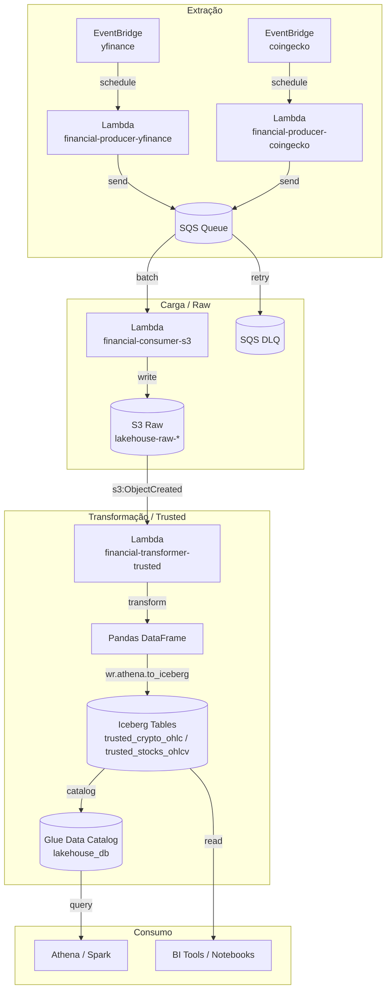

# Serverless Financial Data Lakehouse


## 🚀 Visão Geral

Este projeto implementa um **pipeline de dados financeiros totalmente serverless** na AWS, projetado para ingerir, processar e armazenar dados de criptomoedas (via CoinGecko) e ações (via Yahoo Finance) em um **Data Lakehouse moderno**.

A arquitetura segue o padrão **Medallion simplificado** (Raw → Trusted) e utiliza **Apache Iceberg** como camada de tabela, permitindo consultas SQL eficientes, versionamento de dados e operações ACID – tudo isso com custos otimizados e escalabilidade automática.

## 🏗️ Arquitetura Medallion Simplificada

O fluxo de dados é **100% event‑driven**, dividido em três estágios principais:

### 1. **Extração (Producers)**
- **Lambda `financial-producer-yfinance`**: Acionada diariamente após o fechamento do mercado (via EventBridge), coleta dados OHLCV de ações.
- **Lambda `financial-producer-coingecko`**: Executada diariamente à meia‑noite UTC, obtém dados OHLC de criptomoedas.
- Ambas as funções enviam os dados brutos para uma **fila SQS** (`financial-api-ingestion-queue`), garantindo durabilidade e desacoplamento.

### 2. **Carga / Camada Raw**
- **Lambda `financial-consumer-s3`**: Consome mensagens da fila SQS em lotes, aplica validação básica e persiste os dados no bucket **`lakehouse-raw-<suffix>`** no formato JSON, particionado por fonte (`producer_coingecko` ou `producer_yfinance`) e data (`year=.../month=.../day=...`).
- Em caso de falha recorrente, as mensagens são redirecionadas para uma **Dead‑Letter Queue (DLQ)** (`financial-api-ingestion-dlq`).

### 3. **Transformação / Camada Trusted**
- **Lambda `financial-transformer-trusted`**: Disparada automaticamente por eventos S3 (criação de objetos `.json` no bucket raw), converte os dados JSON em DataFrames Pandas, aplica transformações específicas por fonte (normalização de schema, tipagem, enriquecimento) e grava as tabelas **Apache Iceberg** no bucket **`lakehouse-trusted-<suffix>`**.
- A escrita no Iceberg é realizada via **AWS Data Wrangler** utilizando o motor do Athena, que gerencia automaticamente os metadados no **AWS Glue Data Catalog** (banco `lakehouse_db`), criando as tabelas `trusted_crypto_ohlc` e `trusted_stocks_ohlcv` particionadas por `ingestion_date`.



## 🛠️ Stack Tecnológico

| Camada           | Tecnologia                                                                 |
|------------------|----------------------------------------------------------------------------|
| **Orquestração** | AWS EventBridge (cron)                                                     |
| **Processamento**| AWS Lambda (Python 3.12)                                                   |
| **Fila/Mensageria**| AWS SQS (Standard + DLQ)                                                 |
| **Armazenamento**| AWS S3 (Raw, Trusted, Deployment)                                          |
| **Catálogo**     | AWS Glue Data Catalog                                                      |
| **Formato de Tabela** | Apache Iceberg                                                          |
| **ETL**          | Pandas, AWS Data Wrangler (awswrangler)                                    |
| **Infra como Código** | Terraform (AWS provider ~> 6.0)                                        |
| **CI/CD**        | GitHub Actions (matriz de deploy paralelo)                                 |
| **Monitoramento**| Amazon CloudWatch Logs                                                     |

## 🔁 Resiliência

- **Dead‑Letter Queue (DLQ)**: A fila principal SQS está configurada com `maxReceiveCount=3`. Após três tentativas malsucedidas, a mensagem é movida para a DLQ para inspeção manual.
- **Partial Batch Response**: A Lambda consumer utiliza o recurso de relatório parcial de lotes, garantindo que apenas as mensagens com falha sejam retidas para reprocessamento, evitando a repetição de itens já processados.
- **Timeout generosos**: As Lambdas de transformação possuem timeout de 5 minutos, adequado para operações com o Athena.
- **Permissões granulares**: Cada função possui uma IAM Role específica, seguindo o princípio do menor privilégio.

## 🌍 Infraestrutura como Código

Toda a infraestrutura é definida e provisionada via **Terraform** (arquivos em `terraform/`). Os principais recursos gerenciados incluem:

- **Lambdas** (funções, layers, triggers, permissões)
- **S3 Buckets** (raw, trusted, deployment)
- **SQS Queues** (fila principal e DLQ)
- **IAM Roles & Policies** (permissões granulares para cada função)
- **EventBridge Rules** (agendamento dos producers)
- **Glue Database** (`lakehouse_db`)

A configuração é modular e utiliza variáveis para customização (ex.: nome do banco Glue, prefixo das tabelas Iceberg).

## 🔄 CI/CD com GitHub Actions

O pipeline de deploy está automatizado via **GitHub Actions** (`.github/workflows/deploy.yml`). A estratégia adotada é:

1. **Matriz de deploy paralelo**: O workflow é executado em uma matriz que itera sobre as quatro funções Lambda, permitindo que o deploy de cada uma ocorra simultaneamente, reduzindo o tempo total.
2. **Versionamento via commit SHA**: Cada pacote de código é versionado com o hash do commit, garantindo rastreabilidade.
3. **Upload para S3 de deployment**: O código compactado é enviado para o bucket `lambda-deployment-<suffix>`.
4. **Atualização da Lambda**: A função correspondente é atualizada referenciando o novo objeto no S3.

O fluxo é acionado a cada push na branch `main` ou manualmente via `workflow_dispatch`.

## 🚀 Como Executar / Fazer Deploy

### Pré‑requisitos
- Conta AWS com credenciais configuradas (AWS CLI ou variáveis de ambiente)
- Terraform ≥ 1.0 instalado
- GitHub Actions configuradas com secrets `AWS_ACCESS_KEY_ID` e `AWS_SECRET_ACCESS_KEY`

### Passo a passo

1. **Clone o repositório**
   ```bash
   git clone <repo-url>
   cd <repo-dir>
   ```

2. **Provisione a infraestrutura com Terraform**
   ```bash
   cd terraform
   terraform init
   terraform plan -out=tfplan
   terraform apply tfplan
   ```
   Anote os outputs, especialmente os nomes dos buckets S3.

3. **Execute o pipeline de CI/CD**
   - Faça push para a branch `main` ou dispare manualmente o workflow **Deploy Lambdas** no GitHub Actions.
   - As quatro funções Lambda serão atualizadas com o código de `src/`.

4. **Verifique a execução**
   - Acesse o Console AWS e confira as execuções das Lambdas no CloudWatch Logs.
   - Consulte as tabelas Iceberg no Glue Data Catalog (`lakehouse_db.trusted_crypto_ohlc` e `lakehouse_db.trusted_stocks_ohlcv`).

### Testando localmente (desenvolvimento)
- Cada função possui seu próprio `requirements.txt` e pode ser testada em ambiente virtual Python.
- Utilize o arquivo `dummy.zip` em `terraform/` para simular o pacote durante testes de Terraform.

## 📄 Licença

Este projeto é destinado a fins educacionais e de demonstração. Sinta‑se à vontade para adaptá‑lo às suas necessidades.

---

**Feito com ❤️ pela equipe de Engenharia de Dados.**
