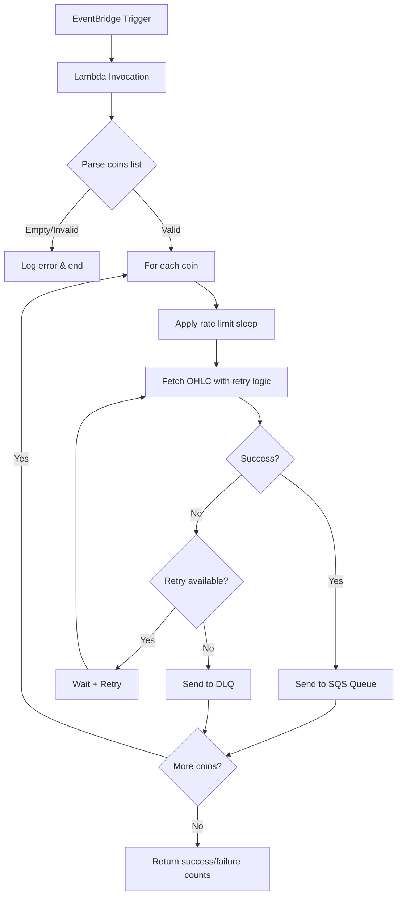

# Especificação Técnica: Lambda Producer CoinGecko

## 1. Visão Geral
Função AWS Lambda em Python que coleta dados OHLC (Open, High, Low, Close) diários de criptomoedas através da API pública do CoinGecko e os envia para uma fila SQS para processamento posterior.

## 2. Gatilho (Trigger) e Entrada
- **Serviço**: Amazon EventBridge (CloudWatch Events)
- **Agendamento**: Diariamente às 00:00 UTC (`cron(0 0 * * ? *)`)
- **Payload de Entrada** (JSON):
  ```json
  {
    "coins": ["bitcoin", "ethereum", "cardano", "solana"]
  }
  ```
- **Nota**: A lista de moedas pode ser customizada via payload do EventBridge. Se o campo `coins` não estiver presente ou estiver vazio, a função deve registrar um erro e encerrar sem processamento.

## 3. Processamento

### 3.1. Coleta de Dados
- **API**: CoinGecko Public API (gratuita)
- **Endpoint**: `GET https://api.coingecko.com/api/v3/coins/{id}/ohlc`
- **Parâmetros obrigatórios**:
  - `days`: 1 (para obter OHLC diário)
  - `vs_currency`: usd (fixo)
- **Formato de Resposta**: Array de arrays `[timestamp, open, high, low, close]` em milissegundos.
- **Exemplo de resposta**:
  ```json
  [
    [1743811200000, 90000.5, 92000.0, 89000.0, 91000.0]
  ]
  ```

### 3.2. Controle de Rate Limit
- **Limite da API**: 30 requisições por minuto.
- **Implementação**: Inserir `time.sleep(2)` entre cada requisição para garantir média de 30 req/min (60 segundos / 30 requisições = 2 segundos por requisição).
- **Monitoramento**: Logar o tempo restante entre chamadas para evitar violação.

### 3.3. Mecanismo de Retry com Backoff Exponencial
- **Condições para retry**:
  - HTTP 429 (Too Many Requests)
  - HTTP 5xx (Erros do servidor)
- **Estratégia**:
  - Tentativas máximas: 3
  - Delay inicial: 1 segundo
  - Fórmula: `delay = base_delay * (2 ** (attempt - 1)) + random_jitter` (jitter entre 0 e 0.5 segundos)
  - Timeout total máximo por moeda: 30 segundos
- **Erros não recuperáveis** (ex: 404 Coin not found, 400 Bad Request): Não fazer retry, enviar direto para DLQ.

## 4. Saída e Roteamento

### 4.1. Sucesso
- **Destino**: Fila SQS principal
- **URL**: Obtida da variável de ambiente `SQS_QUEUE_URL`
- **Formato da Mensagem** (JSON):
  ```json
  {
    "coin_id": "bitcoin",
    "ohlc_data": [
      [1743811200000, 90000.5, 92000.0, 89000.0, 91000.0]
    ],
    "timestamp": "2025-04-05T00:00:00Z",
    "vs_currency": "usd"
  }
  ```
- **Atributos da Mensagem**:
  - `source`: Valor fixo `"producer_coingecko"` (tipo String)

### 4.2. Falha Permanente
- **Destino**: Dead Letter Queue (DLQ)
- **URL**: Obtida da variável de ambiente `SQS_DLQ_URL`
- **Condições**:
  - Moeda não encontrada (404)
  - Erro após esgotar todas as tentativas de retry (3 tentativas)
  - Erro de validação (ex: ID de moeda inválido)
- **Formato da Mensagem de Falha** (JSON):
  ```json
  {
    "coin_id": "moeda_inexistente",
    "error": "Coin not found",
    "http_status": 404,
    "timestamp": "2025-04-05T00:00:00Z",
    "retry_count": 3
  }
  ```

## 5. Variáveis de Ambiente
| Nome | Descrição | Exemplo |
|------|-----------|---------|
| `SQS_QUEUE_URL` | URL da fila SQS principal | `https://sqs.us-east-1.amazonaws.com/123456789012/financial-api-ingestion-queue` |
| `SQS_DLQ_URL` | URL da Dead Letter Queue | `https://sqs.us-east-1.amazonaws.com/123456789012/financial-api-ingestion-dlq` |
| `LOG_LEVEL` | Nível de log da aplicação (DEBUG, INFO, WARN, ERROR) | `INFO` |

## 6. Requisitos Não Funcionais

### 6.1. Performance
- **Timeout Lambda**: 5 minutos (configurado via Terraform)
- **Memória**: 256 MB (suficiente para processamento em lote)
- **Concorrência**: Processamento sequencial para respeitar rate limit (não usar threads assíncronas que ultrapassem o limite)

### 6.2. Resiliência
- **Retry nativo**: Configurar DLQ na Lambda para falhas de invocação (já implementado via redrive policy da fila SQS)
- **Logs**: Todos os eventos devem ser registrados no CloudWatch Logs com contexto adequado (coin_id, tentativa, status)
- **Métricas**: Emitir métricas customizadas para:
  - `CoinsProcessed`: Contador de moedas processadas com sucesso
  - `CoinsFailed`: Contador de moedas que falharam
  - `APILatency`: Tempo médio de resposta da API CoinGecko

### 6.3. Segurança
- **Permissões IAM**: Apenas permissões necessárias para:
  - Enviar mensagens para SQS (fila principal e DLQ)
  - Escrever logs no CloudWatch
- **API Key**: Não requerida (API pública)

## 7. Fluxo de Execução



## 8. Considerações de Implementação

### 8.1. Código Python
- **Versão**: Python 3.12
- **Bibliotecas principais**:
  - `requests` para chamadas HTTP
  - `boto3` para interação com SQS
  - `tenacity` para retry com backoff exponencial (opcional, pode ser implementado manualmente)

### 8.2. Estrutura do Código
```python
import os
import json
import time
import random
from typing import Dict, List, Any
import requests
import boto3

def fetch_ohlc(coin_id: str, retries: int = 3) -> Dict[str, Any]:
    # Implementar com rate limit e retry
    pass

def send_to_sqs(queue_url: str, message_body: Dict, message_attributes: Dict):
    # Enviar para SQS com atributo source
    pass

def lambda_handler(event: Dict[str, Any], context: Any) -> Dict[str, Any]:
    # 1. Validação do payload
    # 2. Processamento sequencial das moedas
    # 3. Controle de rate limit
    # 4. Envio para SQS/DLQ
    # 5. Agregação de resultados
    pass
```

### 8.3. Testes
- **Unitários**: Mock de API e SQS
- **Integração**: Teste com API real (ambiente de desenvolvimento)
- **Carga**: Verificar respeito ao rate limit com múltiplas moedas

## 9. Monitoramento e Alertas

### 9.1. Métricas CloudWatch
- `CoinsProcessed`: Contador de moedas processadas com sucesso
- `CoinsFailed`: Contador de moedas que falharam
- `APILatency`: Tempo médio de resposta da API CoinGecko

### 9.2. Alertas
- **Alerta Crítico**: Mais de 50% das moedas falharem em uma execução
- **Alerta de Performance**: Latência média acima de 10 segundos por moeda
- **Alerta de Rate Limit**: Múltiplos erros 429 em um curto período

## 10. Rollback e Versionamento
- **Versionamento**: Cada deploy deve ter uma tag semântica
- **Rollback**: Manter versões anteriores da Lambda por 7 dias
- **Aliases**: Usar `prod` e `dev` para gerenciamento de ambientes

---

*Documento gerado em: 2025-04-05*
*Última revisão: -*
