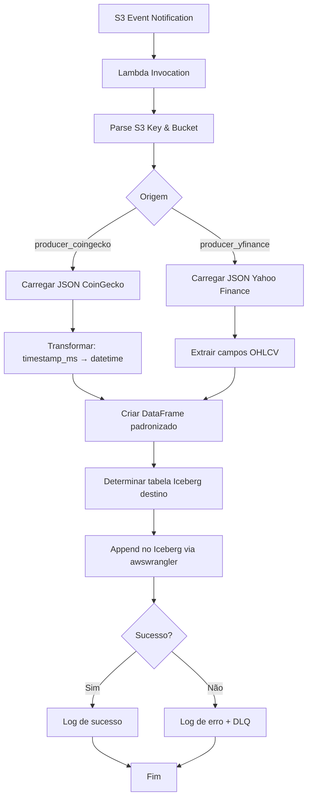

# Especificação Técnica: Lambda Transformer Trusted

## 1. Visão Geral
Função AWS Lambda em Python que transforma dados brutos da camada **raw** (JSON) em um formato estruturado e padronizado na camada **trusted**, utilizando tabelas Apache Iceberg gerenciadas pelo AWS Glue Data Catalog. A função é acionada automaticamente por notificações de eventos S3 e aplica lógicas de transformação específicas conforme a origem dos dados (`producer_coingecko` ou `producer_yfinance`).

## 2. Gatilho (Trigger)
- **Serviço**: Amazon S3 Event Notifications
- **Bucket de Origem**: Bucket da camada raw (`lakehouse-raw-*`)
- **Eventos**: `s3:ObjectCreated:*` (apenas para objetos com extensão `.json`)
- **Filtro de Prefixo**: `raw/`
- **Configuração**: Uma notificação S3 será configurada para invocar a Lambda sempre que um novo arquivo `.json` for criado em qualquer subdiretório sob `raw/`.

## 3. Roteamento e Lógica de Transformação

### 3.1. Identificação da Origem
A origem é determinada pelo caminho do arquivo S3 (S3 Key):
- **Exemplo de key**: `raw/producer_coingecko/year=2025/month=04/day=05/abc123.json`
- **Lógica**: 
  - Se a key contiver `producer_coingecko` → aplicar pipeline de transformação para dados CoinGecko.
  - Se a key contiver `producer_yfinance` → aplicar pipeline de transformação para dados Yahoo Finance.

### 3.2. Pipeline para `producer_coingecko`
1. **Leitura do JSON**: O arquivo contém um array de arrays no formato `[timestamp_ms, open, high, low, close]`.
2. **Conversão de Timestamp**:
   - Converter `timestamp_ms` (milissegundos desde epoch) para `datetime` UTC.
   - Criar coluna `timestamp` no formato ISO 8601 (`YYYY-MM-DD HH:MM:SS`).
3. **Estrutura do DataFrame**:
   - Colunas: `timestamp`, `open`, `high`, `low`, `close`, `coin_id`, `ingestion_date`
   - `coin_id` extraído do nome do arquivo ou do caminho (ex: `bitcoin`).
   - `ingestion_date` = data de ingestão (partição do caminho raw).

### 3.3. Pipeline para `producer_yfinance`
1. **Leitura do JSON**: O arquivo contém um objeto com campos OHLCV (Open, High, Low, Close, Volume) e metadados.
2. **Estrutura do DataFrame**:
   - Colunas: `timestamp`, `open`, `high`, `low`, `close`, `volume`, `ticker`, `ingestion_date`
   - `ticker` extraído do payload (ex: `AAPL`).
   - `ingestion_date` = data de ingestão.

## 4. Processamento e Formato Final (Iceberg)

### 4.1. Biblioteca Principal
- **awswrangler** (AWS SDK for pandas): Utilizada para interagir com o AWS Glue Data Catalog e escrever dados no formato Apache Iceberg.

### 4.2. Fluxo de Escrita
1. **Conexão com Glue Data Catalog**:
   - Banco de dados: Variável de ambiente `GLUE_DATABASE_NAME`
   - Tabela Iceberg: `trusted_crypto_ohlc` (para dados CoinGecko) e `trusted_stocks_ohlcv` (para dados Yahoo Finance)
2. **Modo de Escrita**: `append` (inserção de novos registros)
3. **Localização Iceberg**: Bucket da camada trusted (`lakehouse-trusted-*`) com prefixo `iceberg/`
4. **Operação via awswrangler**:
   ```python
   awswrangler.catalog.create_iceberg_table(...)  # se a tabela não existir
   awswrangler.dataframes.to_iceberg(
       df=df_transformed,
       database=GLUE_DATABASE_NAME,
       table=table_name,
       table_location=s3_iceberg_path,
       partition_cols=["ingestion_date"],
       mode="append"
   )
   ```

### 4.3. Estrutura das Tabelas Iceberg
#### Tabela `trusted_crypto_ohlc`
| Coluna         | Tipo        | Descrição                          |
|----------------|-------------|------------------------------------|
| timestamp      | timestamp   | Data/hora da cotação (UTC)         |
| open           | double      | Preço de abertura                  |
| high           | double      | Preço máximo                       |
| low            | double      | Preço mínimo                       |
| close          | double      | Preço de fechamento                |
| coin_id        | string      | Identificador da criptomoeda       |
| ingestion_date | date        | Data de ingestão (partição)        |

#### Tabela `trusted_stocks_ohlcv`
| Coluna         | Tipo        | Descrição                          |
|----------------|-------------|------------------------------------|
| timestamp      | timestamp   | Data/hora da cotação (UTC)         |
| open           | double      | Preço de abertura                  |
| high           | double      | Preço máximo                       |
| low            | double      | Preço mínimo                       |
| close          | double      | Preço de fechamento                |
| volume         | bigint      | Volume negociado                   |
| ticker         | string      | Símbolo da ação                    |
| ingestion_date | date        | Data de ingestão (partição)        |

## 5. Variáveis de Ambiente
| Nome                   | Descrição                                           | Exemplo                          |
|------------------------|-----------------------------------------------------|----------------------------------|
| `TRUSTED_BUCKET`       | Bucket S3 da camada trusted                         | `lakehouse-trusted-abc123`       |
| `GLUE_DATABASE_NAME`   | Nome do banco de dados no Glue Data Catalog         | `lakehouse_db`                   |
| `LOG_LEVEL`            | Nível de log (DEBUG, INFO, WARN, ERROR)             | `INFO`                           |

## 6. Requisitos Não Funcionais

### 6.1. Performance
- **Timeout Lambda**: 300 segundos (5 minutos)
- **Memória**: 512 MB (suficiente para processar DataFrames de até 100 MB)
- **Concorrência**: Até 10 invocações simultâneas (ajustável conforme volume)

### 6.2. Resiliência
- **Retry Nativo**: A notificação S3 possui retry automático (2 tentativas)
- **Dead Letter Queue (DLQ)**: Configurar uma DLQ SQS para eventos que falharem repetidamente
- **Logs**: Todos os passos devem ser registrados no CloudWatch Logs (arquivo de origem, linhas processadas, erros)

### 6.3. Segurança
- **Permissões IAM**:
  - Leitura do bucket raw (`s3:GetObject`)
  - Escrita no bucket trusted (`s3:PutObject`, `s3:DeleteObject` para Iceberg)
  - Acesso ao Glue Data Catalog (`glue:CreateTable`, `glue:GetTable`, `glue:UpdateTable`)
  - Acesso ao Lake Formation (se necessário para governança)
- **Criptografia**: Dados em trânsito (HTTPS) e em repouso (SSE-S3)

## 7. Fluxo de Execução



## 8. Considerações de Implementação

### 8.1. Código Python
- **Versão**: Python 3.12
- **Bibliotecas principais**:
  - `awswrangler>=3.0.0` (com suporte a Iceberg)
  - `pandas>=2.0.0`
  - `boto3>=1.34.0`

### 8.2. Estrutura do Código
```python
import os
import json
import awswrangler as wr
import pandas as pd
from datetime import datetime

def determine_source(s3_key: str) -> str:
    # Retorna 'coingecko' ou 'yfinance'

def transform_coingecko(raw_json: dict, s3_key: str) -> pd.DataFrame:
    # Converte array OHLC e extrai coin_id

def transform_yfinance(raw_json: dict, s3_key: str) -> pd.DataFrame:
    # Extrai campos OHLCV e ticker

def write_to_iceberg(df: pd.DataFrame, table_name: str):
    # Usa awswrangler para append na tabela Iceberg

def lambda_handler(event, context):
    # 1. Extrair bucket e key do evento S3
    # 2. Carregar JSON do S3
    # 3. Identificar origem e aplicar transformação
    # 4. Escrever no Iceberg
    # 5. Tratar exceções e retornar status
```

### 8.3. Testes
- **Unitários**: Mock de S3, Glue e awswrangler
- **Integração**: Teste com bucket S3 real e tabela Iceberg de desenvolvimento
- **Desempenho**: Processamento de arquivos com até 10.000 linhas

## 9. Monitoramento e Alertas

### 9.1. Métricas CloudWatch
- `FilesProcessed`: Contador de arquivos processados com sucesso
- `FilesFailed`: Contador de arquivos com erro
- `IcebergWriteLatency`: Tempo médio de escrita no Iceberg

### 9.2. Alertas
- **Alerta Crítico**: Taxa de falha superior a 5% por 15 minutos
- **Alerta de Performance**: Latência média acima de 30 segundos por arquivo
- **Alerta de Volume**: Mais de 100 eventos na DLQ

## 10. Rollback e Versionamento
- **Versionamento**: Cada deploy deve ter uma tag semântica
- **Rollback**: Manter versões anteriores da Lambda por 7 dias
- **Aliases**: Usar `prod` e `dev` para gerenciamento de ambientes

---

*Documento gerado em: 2025-04-05*
*Última revisão: -*
